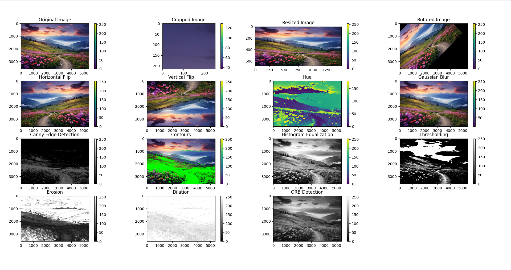

# OpenCV Image Processing

This Python script demonstrates various image processing techniques using the OpenCV library. It includes operations such as cropping, resizing, rotation, flipping, color space conversion, blur, edge detection, contour detection, histogram equalization, thresholding, erosion, dilation, and ORB (Oriented FAST and Rotated BRIEF) feature detection.

## Dependencies

- Python 3.x
- OpenCV
- NumPy
- Matplotlib

## Usage

1. Clone the repository:

    ```bash
    git clone https://github.com/your-username/your-repository.git
    ```

2. Navigate to the project directory:

    ```bash
    cd your-repository
    ```

3. Install dependencies:

    ```bash
    pip install opencv-python numpy matplotlib
    ```

4. Run the script:

    ```bash
    python image_processing.py
    ```

## Example Image


## Code Overview

- **Image Loading:**
  - Original image and grayscale image are loaded using OpenCV.

- **Basic Operations:**
  - Cropping, resizing, rotation, horizontal and vertical flips are performed.

- **Color Space Conversion:**
  - Conversion to the HSV color space, extraction of the hue channel.

- **Image Filtering:**
  - Gaussian blur is applied to the original image.

- **Edge Detection:**
  - Canny edge detection is performed.

- **Contours:**
  - Contours are detected using the Canny edge output.

- **Histogram Equalization:**
  - Histogram equalization is applied to enhance image contrast.

- **Thresholding:**
  - Simple thresholding is applied to create binary images.

- **Morphological Operations:**
  - Erosion and dilation are performed using a specified kernel.

- **Feature Detection:**
  - ORB feature detection is applied, and keypoints are visualized.

- **Visualization:**
  - The processed images are visualized using Matplotlib.

## Acknowledgments

- [OpenCV](https://opencv.org/)
- [Matplotlib](https://matplotlib.org/)

